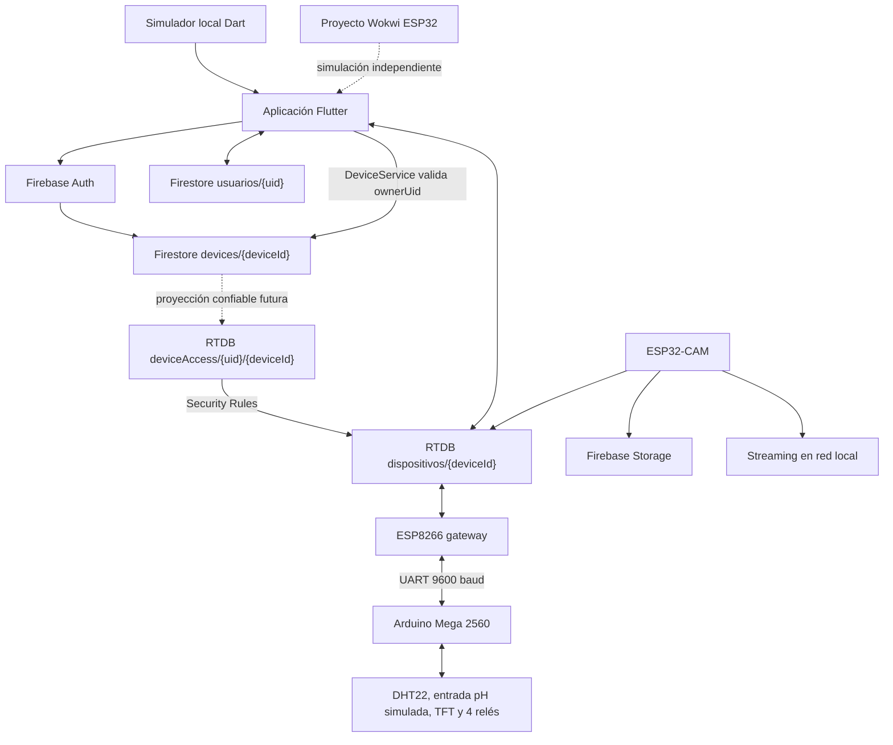

# Arquitectura de HydroStack

Este documento describe la arquitectura comprobada en el código versionado. Los nombres internos HidroSmart y HuertaViva se conservan porque su migración no forma parte de esta fase.

## Vista general

`devices/{deviceId}` en Firestore es la fuente canónica de ownership. `deviceAccess/{uid}/{deviceId}` en RTDB es una proyección derivada necesaria para que las reglas de Realtime Database puedan autorizar por UID; no debe ser modificada por clientes.

## Aplicación Flutter

La aplicación está en `apps/mobile/` y usa Riverpod para estado y GoRouter para navegación. Al arrancar intenta inicializar Firebase. Si la inicialización falla, `firebaseReady` queda en `false` y los providers seleccionan servicios mock donde existe esa alternativa.

La selección de datos funciona así:

- `usarHardware = false`: `WokwiService` inicia una simulación Dart local.
- `usarHardware = true` y `useDevelopmentDevice = false`: `authorizedDeviceProvider` resuelve un dispositivo cuya propiedad está confirmada en Firestore y solo entonces `RTDBService` usa `dispositivos/{deviceId}`.
- `usarHardware = true` y `useDevelopmentDevice = true`: se usa un ID manual de laboratorio. Este modo está explícitamente separado y no crea ownership.

Un `preferredDeviceId` guardado localmente es únicamente un selector. No es autoridad de seguridad.

## Dominio de dispositivo

`HydroStackDevice` representa:

- `deviceId`: identidad técnica única;
- `ownerUid`: propietario autenticado;
- `alias`: nombre visible;
- `status`;
- timestamps de creación, claim y actualización.

`DeviceService` centraliza:

- lista de dispositivos propios;
- lectura de un dispositivo propio;
- comprobación de ownership;
- resolución del dispositivo autorizado para RTDB;
- actualización de alias permitida.

La creación/claim de un dispositivo está intencionalmente fuera del cliente en esta fase.

## Nodo de control local

El Arduino Mega 2560 es el nodo que lee los sensores confirmados, actualiza la pantalla TFT y acciona los cuatro relés. Envía una trama CSV cada dos segundos por `Serial1` y recibe comandos de texto del gateway. Los pulsos de bomba y nutrientes duran cinco segundos; luz y auxiliar mantienen estado.

No se modificó firmware ni UART en esta fase.

## Gateway de Internet

El ESP8266 no contiene sensores ni pantalla en la versión activa. Su función es conectar la instalación a WiFi y Firebase RTDB:

- recibe la trama CSV del Mega por UART;
- publica telemetría cada diez segundos;
- sondea comandos cada tres segundos;
- reenvía comandos al Mega;
- publica información de arranque del dispositivo.

El firmware continúa usando `DEVICE_ID "HS-001"` y autenticación legacy; ambos quedan pendientes de fases posteriores. El nuevo contrato Flutter evita considerar `HS-001` un dispositivo real autorizado por defecto.

## Nodo de cámara

El ESP32-CAM es independiente del Mega y del ESP8266. Usa su propia conexión WiFi, ofrece una página local en el puerto 80 y un stream MJPEG en el puerto 81. El firmware contempla una captura periódica cada seis horas, subida a Firebase Storage y publicación de metadatos en RTDB.

La ruta Storage segura preparada para el futuro es `devices/{deviceId}/...`. La ruta legacy `capturas/` permanece cerrada por reglas hasta migrar autenticación y firmware de cámara.

## Distribución de datos

### Cloud Firestore

- `devices/{deviceId}`: identidad y ownership canónico.
- `usuarios/{uid}`: perfil, modo y referencias legacy.
- `usuarios/{uid}/huerta/config`: nombre, capacidad, estado/ID legacy del controlador y plantas instaladas.
- `usuarios/{uid}/cosechas/{id}`: registros de cosecha.

Los campos `deviceId` del perfil y `esp32Id`/`esp32Connected` se conservan temporalmente por compatibilidad, pero no autorizan control de hardware.

### Realtime Database

- `deviceAccess/{uid}/{deviceId}`: proyección de autorización mantenida por infraestructura confiable futura; clientes no escriben.
- `dispositivos/{deviceId}/telemetria`: firmware ESP8266 escribe; app lee si está autorizada.
- `dispositivos/{deviceId}/info`: firmware ESP8266 escribe al arrancar.
- `dispositivos/{deviceId}/comandos`: app autorizada escribe; gateway lee.
- `dispositivos/{deviceId}/camara`: ESP32-CAM publica metadatos.

### Storage

- ruta futura canónica: `devices/{deviceId}/...`;
- lectura cliente: solo owner según Firestore;
- escritura cliente: denegada en esta fase;
- ruta legacy `capturas/`: cerrada hasta migración de cámara.

## Simulación y desarrollo

Hay tres piezas diferenciadas:

- `apps/mobile/lib/services/wokwi_service.dart`: simulación local que alimenta directamente la app;
- `simulations/wokwi/`: proyecto Wokwi independiente;
- `docs/legacy/simulations/esp32-controller-v2/`: simulación histórica.

El ID manual de hardware de desarrollo se guarda como `developmentDeviceId`. `HS-001` permanece allí únicamente para no romper el laboratorio actual y `useDevelopmentDevice` está apagado por defecto.
