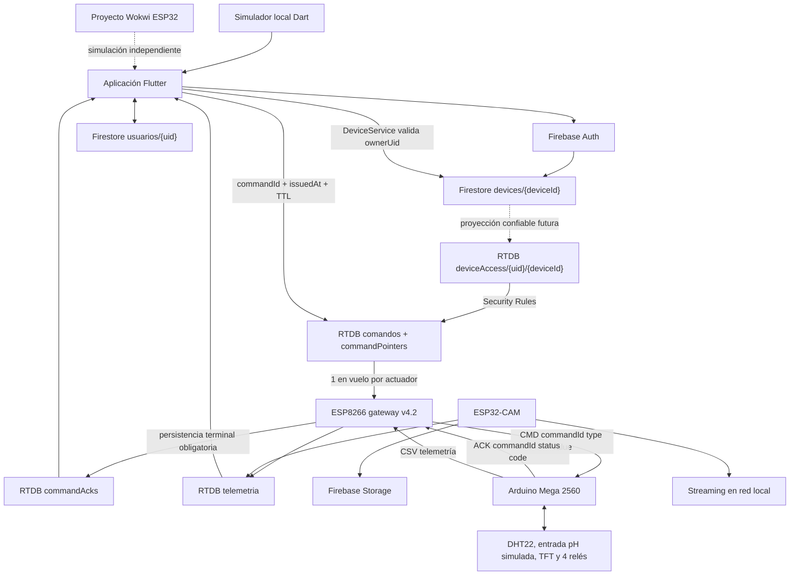

# Arquitectura de HydroStack

Este documento describe la arquitectura comprobada en el código versionado. Los nombres internos HidroSmart y HuertaViva se conservan porque su migración no forma parte de esta fase.

## Vista general



`devices/{deviceId}` en Firestore es la fuente canónica de ownership. `deviceAccess/{uid}/{deviceId}` en RTDB es una proyección derivada necesaria para que las reglas de Realtime Database puedan autorizar por UID; no debe ser modificada por clientes.

## Aplicación Flutter

La aplicación está en `apps/mobile/` y usa Riverpod para estado y GoRouter para navegación. Al arrancar intenta inicializar Firebase. Si la inicialización falla, `firebaseReady` queda en `false` y los providers seleccionan servicios mock donde existe esa alternativa.

La selección de datos funciona así:

- `usarHardware = false`: `WokwiService` inicia una simulación Dart local.
- `usarHardware = true` y `useDevelopmentDevice = false`: `authorizedDeviceProvider` resuelve un dispositivo cuya propiedad está confirmada en Firestore y solo entonces `RTDBService` usa `dispositivos/{deviceId}`.
- `usarHardware = true` y `useDevelopmentDevice = true`: se usa un ID manual de laboratorio. Este modo está explícitamente separado y no crea ownership.

Un `preferredDeviceId` guardado localmente es únicamente un selector. No es autoridad de seguridad.

Para hardware real, `RTDBService` ya no escribe booleanos momentáneos. Crea un registro inmutable con `commandId`, timestamp servidor, TTL y UID solicitante, y después mueve el `commandPointer` del actuador.

## Dominio de dispositivo

`HydroStackDevice` representa:

- `deviceId`: identidad técnica única;
- `ownerUid`: propietario autenticado;
- `alias`: nombre visible;
- `status`;
- timestamps de creación, claim y actualización.

`DeviceService` centraliza lista, lectura, comprobación de ownership, resolución del dispositivo autorizado y actualización de alias.

La creación/claim de un dispositivo está intencionalmente fuera del cliente en esta fase.

## Contrato de comandos

El protocolo v2 está documentado en `docs/commands.md`.

Por cada actuador:

```text
comandos/{actuator}/{commandId}
commandPointers/{actuator} -> commandId
commandAcks/{actuator}/{commandId}
```

Los comandos son inmutables y tienen TTL. El puntero solo puede referenciar un comando existente del usuario autorizado.

El gateway serializa cada actuador: mientras una orden esté pendiente no procesa otra del mismo actuador. El cambio de pointer no implica que la orden anterior haya sido rechazada.

## Nodo de control local

El Arduino Mega 2560 continúa concentrando sensores, TFT y cuatro relés. La telemetría hacia el ESP8266 conserva el CSV anterior cada dos segundos para evitar mezclar esta fase con una migración general del transporte.

La recepción de comandos usa UART v2:

```text
CMD|<commandId>|<type>|<0|1>
```

El Mega responde:

```text
ACK|<commandId>|<status>|<code>
```

Para bomba y nutrientes:

- duración física fija local: 5 s;
- cooldown local: 10 s;
- guard de boot para pulsos nuevos: 10 s;
- último `commandId` aplicado persistido en EEPROM antes de energizar el relé;
- un reintento con el mismo ID responde `DUPLICATE` sin repetir el pulso;
- comandos UART legacy están deshabilitados por defecto.

La lógica ADC/pH se conserva sin corregir porque pertenece a otra fase.

## Gateway de Internet

El ESP8266 sigue siendo el puente entre WiFi/Firebase y el Mega.

En v4.2:

- recibe telemetría CSV del Mega;
- publica telemetría cada diez segundos;
- consulta `commandPointers` aproximadamente cada segundo;
- carga el comando inmutable referenciado;
- valida formato de ID, sobre y TTL;
- usa UTC/NTP para verificar vigencia;
- mantiene como máximo una orden en vuelo por actuador;
- reenvía el mismo `commandId` como máximo tres veces por UART;
- al recibir ACK del Mega detiene los reintentos UART;
- conserva el slot del actuador bloqueado hasta que el ACK terminal quede persistido en RTDB;
- si falla `Firebase.setJSON()`, reintenta la persistencia sin iniciar la siguiente orden;
- si no existe ACK tras haber enviado una orden, usa estado `UNKNOWN` en vez de afirmar falsamente `REJECTED`;
- no inicializa ni resetea comandos al arrancar.

Si NTP todavía no está sincronizado antes del primer envío, el gateway no ejecuta la orden ni la consume definitivamente: vuelve a evaluarla en un poll posterior.

El estado pendiente del gateway sigue siendo RAM. Si el ESP8266 reinicia, reconstruye a partir del pointer y el registro RTDB. Para pulsos, la EEPROM del Mega protege contra repetir físicamente el mismo `commandId`.

El firmware continúa usando `DEVICE_ID "HS-001"` y autenticación Firebase legacy. La identidad/autenticación IoT real queda como siguiente barrera de seguridad.

## Nodo de cámara

El ESP32-CAM es independiente del Mega y del ESP8266. Usa su propia conexión WiFi, ofrece una página local en el puerto 80 y un stream MJPEG en el puerto 81. El firmware contempla una captura periódica cada seis horas, subida a Firebase Storage y publicación de metadatos en RTDB.

La ruta Storage segura preparada para el futuro es `devices/{deviceId}/...`. La ruta legacy `capturas/` permanece cerrada por reglas hasta migrar autenticación y firmware de cámara.

## Distribución de datos

### Cloud Firestore

- `devices/{deviceId}`: identidad y ownership canónico.
- `usuarios/{uid}`: perfil, modo y referencias legacy.
- `usuarios/{uid}/huerta/config`: nombre, capacidad, estado/ID legacy del controlador y plantas instaladas.
- `usuarios/{uid}/cosechas/{id}`: registros de cosecha.

Los campos `deviceId` del perfil y `esp32Id`/`esp32Connected` se conservan temporalmente por compatibilidad, pero no autorizan control de hardware.

### Realtime Database

- `deviceAccess/{uid}/{deviceId}`: proyección de autorización mantenida por infraestructura confiable futura; clientes no escriben.
- `dispositivos/{deviceId}/telemetria`: gateway escribe; app lee si está autorizada.
- `dispositivos/{deviceId}/info`: gateway publica metadatos de arranque.
- `dispositivos/{deviceId}/comandos/{actuator}/{commandId}`: orden inmutable creada por app autorizada.
- `dispositivos/{deviceId}/commandPointers/{actuator}`: selección de la orden más reciente solicitada.
- `dispositivos/{deviceId}/commandAcks/{actuator}/{commandId}`: resultado terminal persistido por gateway.
- `dispositivos/{deviceId}/camara`: ESP32-CAM publica metadatos legacy.

### Storage

- ruta futura canónica: `devices/{deviceId}/...`;
- lectura cliente: solo owner según Firestore;
- escritura cliente: denegada en esta fase;
- ruta legacy `capturas/`: cerrada hasta migración de cámara.

## Simulación y desarrollo

Hay tres piezas diferenciadas:

- `apps/mobile/lib/services/wokwi_service.dart`: simulación local que alimenta directamente la app;
- `simulations/wokwi/`: proyecto Wokwi independiente;
- `docs/legacy/simulations/esp32-controller-v2/`: simulación histórica.

El ID manual de hardware de desarrollo se guarda como `developmentDeviceId`. `HS-001` permanece allí únicamente para no romper el laboratorio actual y `useDevelopmentDevice` está apagado por defecto.
