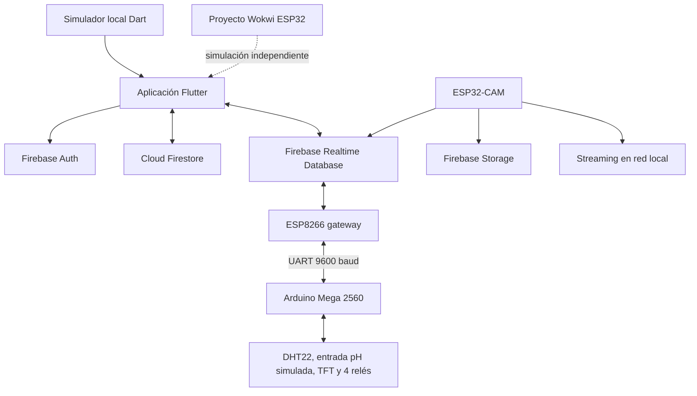

# Arquitectura de HydroStack

Este documento describe la arquitectura comprobada en el código versionado. Los nombres internos HidroSmart y HuertaViva se conservan porque su migración no forma parte de esta fase.

## Vista general

El enlace punteado de Wokwi representa afinidad de formato y propósito, no una conexión automática: la app contiene soporte WebSocket y un simulador local, pero el proyecto Wokwi versionado se ejecuta por separado.

## Aplicación Flutter

La aplicación está en `apps/mobile/` y usa Riverpod para estado y GoRouter para navegación. Al arrancar intenta inicializar Firebase. Si la inicialización falla, `firebaseReady` queda en `false` y los providers seleccionan servicios mock donde existe esa alternativa.

La fuente de telemetría se decide con el ajuste local `usarHardware`:

- `false`: `WokwiService` inicia una simulación Dart local.
- `true`: `RTDBService` escucha `dispositivos/{deviceId}/telemetria`.

Los comandos de la UI siguen la misma selección: actúan sobre el simulador local o escriben en `dispositivos/{deviceId}/comandos`.

## Nodo de control local

El Arduino Mega 2560 es el nodo que lee los sensores confirmados, actualiza la pantalla TFT y acciona los cuatro relés. Envía una trama CSV cada dos segundos por `Serial1` y recibe comandos de texto del gateway. Los pulsos de bomba y nutrientes duran cinco segundos; luz y auxiliar mantienen estado.

## Gateway de Internet

El ESP8266 no contiene sensores ni pantalla en la versión activa. Su función es conectar la instalación a WiFi y Firebase RTDB:

- recibe la trama CSV del Mega por UART;
- publica telemetría cada diez segundos;
- sondea comandos cada tres segundos;
- reenvía comandos al Mega;
- publica información de arranque del dispositivo.

## Nodo de cámara

El ESP32-CAM es independiente del Mega y del ESP8266. Usa su propia conexión WiFi, ofrece una página local en el puerto 80 y un stream MJPEG en el puerto 81. El firmware contempla una captura periódica cada seis horas, subida a Firebase Storage y publicación de metadatos en RTDB. La app Flutter actual no contiene el paquete `firebase_storage` ni una lectura confirmada de la ruta de cámara.

## Distribución de datos

### Cloud Firestore

- `usuarios/{uid}`: perfil, modo y `deviceId`.
- `usuarios/{uid}/huerta/config`: nombre, capacidad, estado/ID del controlador y plantas instaladas.
- `usuarios/{uid}/cosechas/{id}`: registros de cosecha.

El catálogo de plantas, lecturas históricas/semilla y alertas siguen delegados a `MockFirestoreService` incluso cuando Firestore está activo.

### Realtime Database

- `dispositivos/{deviceId}/telemetria`: firmware ESP8266 escribe; app lee.
- `dispositivos/{deviceId}/info`: firmware ESP8266 escribe al arrancar.
- `dispositivos/{deviceId}/comandos`: app escribe; gateway lee y consume comandos momentáneos.
- `dispositivos/{deviceId}/camara`: ESP32-CAM publica IP, URL local del stream y datos de la última foto.

### Storage

El uso confirmado de Firebase Storage está en el firmware ESP32-CAM para capturas JPEG bajo `capturas/`. No hay consumo confirmado de esas capturas en la aplicación Flutter actual.

## Simulación

Hay tres piezas diferenciadas:

- `apps/mobile/lib/services/wokwi_service.dart`: simulación local que alimenta directamente la app.
- `simulations/wokwi/`: proyecto Wokwi con ESP32, dos entradas analógicas y tres salidas representadas por LED.
- `docs/legacy/simulations/esp32-controller-v2/`: simulación anterior conservada como referencia histórica.
